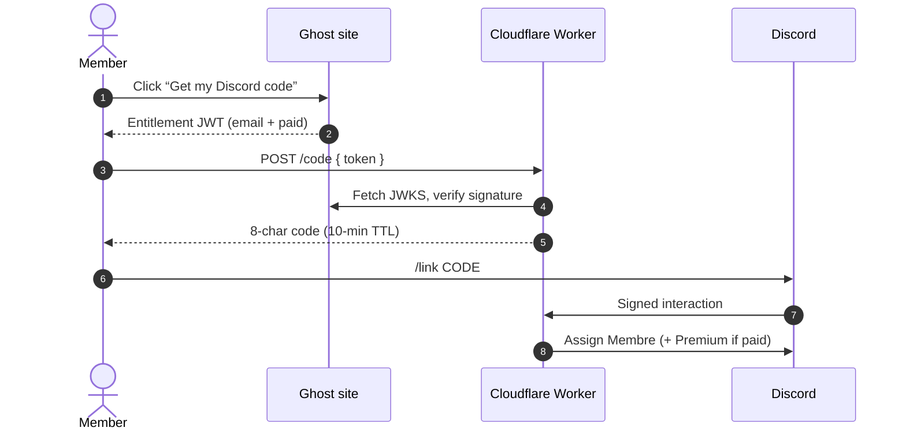
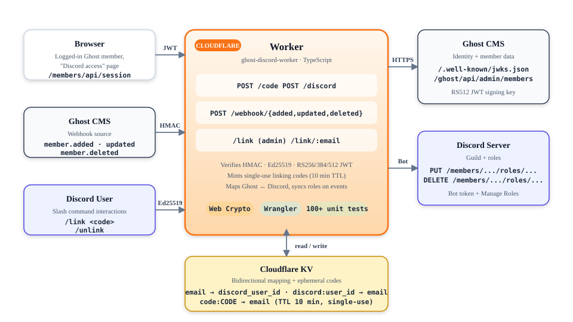

---
hide:
  - navigation
  - toc
---

Cloudflare Worker · TypeScript · Zero runtime dependencies

# Ghost memberships, synced to Discord roles

Your Ghost members link their Discord account in one click, and keep the right roles automatically:
<strong>Membre</strong> for everyone, <strong>Membre Premium</strong> for paid and comped members.

[Get started :material-rocket-launch:](getting-started.md){ .md-button .md-button--primary }
[Discord setup :fontawesome-brands-discord:](discord-setup.md){ .md-button }
[Read the spec :material-book-open-variant:](spec/index.md){ .md-button }

-   :material-shield-key:{ .lg .middle } __Proof of ownership__

    ---

    Members prove they own their Ghost email with a Ghost-signed **entitlement JWT**, verified against your site's JWKS. No email typing, no spoofing.

    [:octicons-arrow-right-24: Authentication](spec/05-authentication.md)

-   :material-lightning-bolt:{ .lg .middle } __Real-time sync__

    ---

    Ghost `member.added`, `member.updated` and `member.deleted` webhooks add or remove roles the moment a subscription changes.

    [:octicons-arrow-right-24: Event handling](spec/06-event-handling.md)

-   :material-cloud-outline:{ .lg .middle } __Serverless & cheap__

    ---

    One Cloudflare Worker plus one KV namespace. Fits comfortably in the free tier, deploys with a single `./deploy.sh`.

    [:octicons-arrow-right-24: Getting started](getting-started.md)

-   :material-check-decagram:{ .lg .middle } __Audited by CI__

    ---

    Type-checking, ≥ 90% test coverage, CodeQL, `npm audit`, dependency review and secret scanning on every push.

    [:octicons-arrow-right-24: Security model](spec/09-security.md)

## How linking works

!!! tip "Origin of the design"
    The single-use code flow and the entitlements token come from the community discussion on the
    [Ghost forum](https://forum.ghost.org/t/discord-ghost-role-sync/61933/8).
